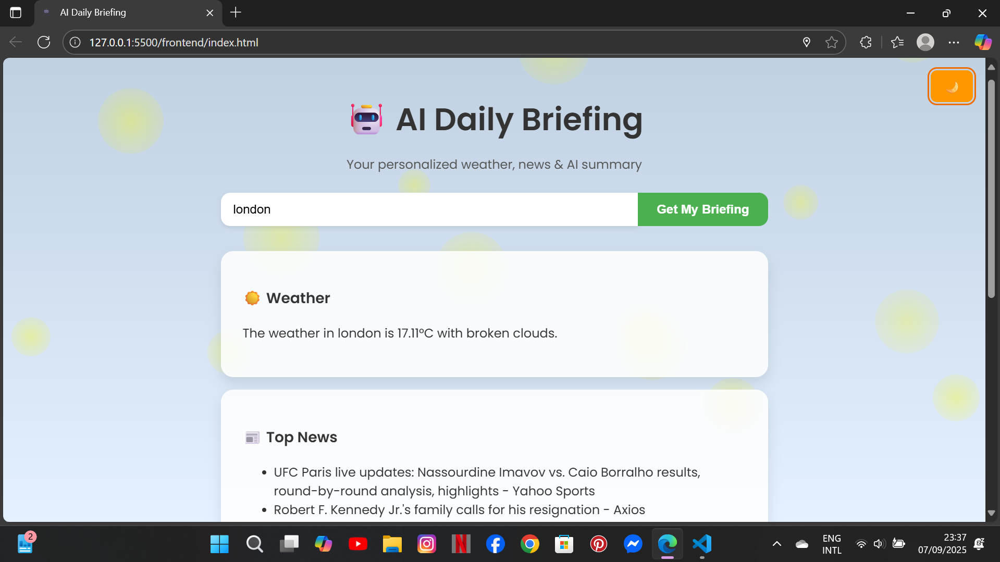

# 🌍 AI Daily Briefing App  

Your personal **AI-powered daily assistant** that gives you:  
- ☀️ **Weather updates** for any city  
- 📰 **Top news headlines**  
- 🤖 **AI-generated briefing summary** (powered by Gemini AI)  
- 📤 **Export features** (copy, PDF, share, voice)  
- 🌙 **Dark/Light mode** with beautiful animations  

---

## 🚀 Features  
- 🌍 **Geolocation detection** → auto-detects your city  
- 🔎 **Search any city** for weather + AI briefing  
- 📰 **News integration** from NewsAPI  
- ☁️ **Weather data** from OpenWeather API  
- 🤖 **AI summary generation** with Gemini  
- 🎨 **Responsive, modern UI** (desktop & mobile friendly)  
- 🎤 **Text-to-speech** briefing  
- 📄 **PDF Export & Copy to Clipboard**  

---

## 🛠️ Tech Stack  
- **Frontend**: HTML, CSS, JavaScript  
- **Backend**: Node.js, Express  
- **AI**: Google Gemini API  
- **APIs**:  
  - [OpenWeather](https://openweathermap.org/)  
  - [NewsAPI](https://newsapi.org/)  
  - [BigDataCloud Reverse Geocode](https://www.bigdatacloud.com/geocoding-apis/reverse-geocode-client)  

---

## 📸 Screenshots  

### 🌞 Light Mode  
  

### 🌙 Dark Mode  
(Add a screenshot here of your dark mode)  

---

## ⚙️ Installation  

### 1️⃣ Clone the repo  
```bash
git clone https://github.com/Rafi-k21/daily-briefing-app.git
cd daily-briefing-app

